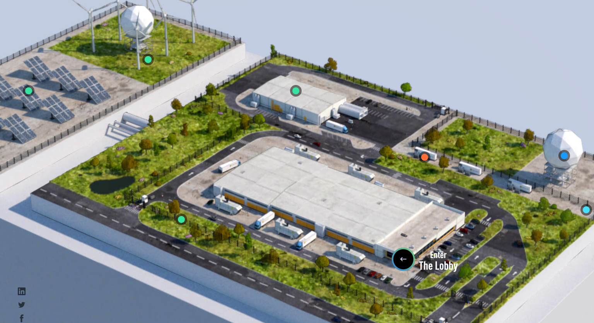

# Azure application architecture

## The [Azure Portal](https://portal.azure.com)

The Azure portal is a **web-based**, unified management console that allows users to create, manage, and monitor a wide range of Azure services and resources. It provides a **graphical user interface** for managing Azure subscriptions, enabling users to perform tasks such as setting up databases, scaling virtual machines, and tracking costs. Additionally, it features customizable dashboards and guided wizards to streamline resource management and enhance user experience.

## The API

Install the CLI tool and create an environment variable so you don't collision with other students:

```bash
curl -sL https://aka.ms/InstallAzureCLIDeb | sudo bash
az version
```

Let's login into Azure using your web browser:

```bash
az login --use-device-code
```

Check what is the current Azure account configuration:

```bash
az account s«how»
```

## Physical global infrastructure


### [Regions](https://datacenters.microsoft.com/globe/explore/) 



An Azure region is a geographic area that contains a **set of data centers** connected through a dedicated low-latency network. These regions allow organizations to deploy their applications and services **closer to their users**, optimizing performance and ensuring **compliance with data residency** requirements. Cost varies between different regions, as the list of available services does.

Each region can consist of one or more data centers, and Azure currently operates over **60 regions worldwide**.

You can list the different locations in Europe using the following command:

```bash
az account list-locations --output table \
  | grep "(Europe)"
```

### [Availability Zones](https://news.microsoft.com/stories/microsoft-datacenter-tour/)

An availability zone in cloud computing is a distinct location within a region that is **designed to be isolated from failures** in other availability zones. Each availability zone has its own independent power, cooling, and networking infrastructure to ensure high availability and fault tolerance. They are geographically separated to mitigate the risk of local disasters affecting multiple zones simultaneously, yet close enough to provide low-latency network connectivity for data replication and resource distribution. This setup allows cloud providers to offer resilient and reliable services by distributing applications and data across multiple availability zones within a region.

Many resources are automatically distributed and region-wide. Others require more attention from
the architecture point of view. For example, not all types of virtual machines can be deployed
on every AZ, as you can check using this snippet: 

```bash
az vm list-skus \
  --location westeurope \
  --all true \
  --resource-type virtualMachines \
  --output table
```

## Logical organization

### Accounts

An Azure Account is the **first identity** created when an organization
joins Azure, using an email address as the subject identifier. The
account is associated to a Tenant.

### Tenants

An Azure tenant is a dedicated and trusted instance of Microsoft Entra ID (formerly Azure Active Directory) that represents an organization in the Microsoft cloud and
it is associated to an account.

* An Azure tenant is essentially a **single instance** of Entra ID that is automatically created when an organization signs up for a Microsoft cloud.
* Each tenant **represents a single organization** and acts as a security boundary, containing all the users, groups, and applications for that organization.
* Every Azure tenant has a globally **unique name and ID**. The tenant name typically ends with "onmicrosoft.com" (e.g., organizationname.onmicrosoft.com).
* The tenant is **responsible for authenticating and authorizing** Azure accounts within the organization. It provides identity and access management services for cloud-based applications. Tenants offer a centralized location for managing user identities, permissions, and access to Azure services across the organization.
* Organizations can have **multiple tenants if needed**, though typically one tenant is sufficient for most organizations.

### Management groups

An Azure management group is a top-level **organizational container** in Azure that helps manage access, policies, and compliance across multiple Azure subscriptions. It allows for **hierarchical organization**, enabling enterprises to apply governance conditions such as policies and role-based access control (RBAC) at a higher level, which then cascade down to all associated subscriptions and resources.

Each Azure Active Directory (Entra ID) tenant has a root management group that encompasses all other management groups and subscriptions, providing a unified structure for efficient and scalable management of Azure resources.

### Subscriptions

An Azure subscription is a **logical container** that organizes and manages Azure resources, serving as a **billing and administrative boundary** for cloud services.

It defines how usage is billed and enabling role-based access control (RBAC) for resource management.

It is common to define a different subscription for **each application**, or even for **each application environment**.

Each subscription is associated with an Azure tenant and can be categorized into various types, such as Pay-as-you-go or Enterprise Agreement, to suit different organizational needs.

### Resource groups

An Azure resource group is a logical container within a subscription that **holds related Azure resources** such as virtual machines, databases, and storage accounts, allowing for easier management and organization. 

It enables users to collectively deploy, monitor, and manage resources that **share the same lifecycle**, such as by project, environment, or department. Resource groups facilitate consistent policy application, access control through role-based access control (RBAC), and **streamlined billing and cost management** by aggregating costs for all resources within the group. Additionally, resources within a resource group can be located in different regions, providing flexibility in resource deployment and management.

Multiple resource groups may be used for different environments, but they are more commonly used for segregating different parts of a complex system.

The region of the resource group is where its metadata is kept, but resources belonging to it can be deployed in any other region.

First, define a unique prefix so your resource names don't collision with any other person:

```bash
export MYPREFIX=<your own prefix, like $USER or a random id>
```

And now, let's create a resource group:

```bash
az group «create» \
  --name $MYPREFIX-rg \
  --location westeurope
```
