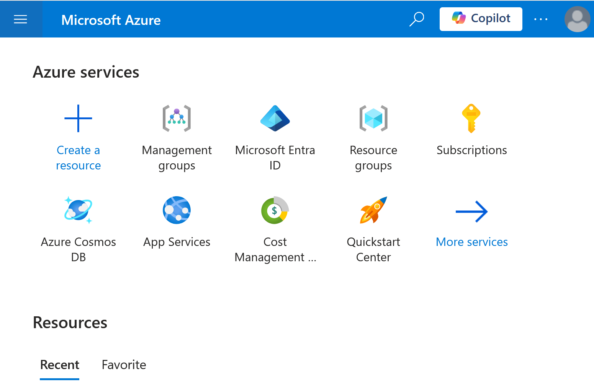

# Manually deploying an application to Azure


The goal of this session will be to **migrate an application** to Azure, understanding basic **identity concepts** and **resource organization**. We will also introduce the most important services, including **Storage Accounts**, **Virtual Networks**, **App Services**, **Azure Vault** and **Azure Database for Postgresql** Flexible Server.

## The [Real World](https://github.com/gothinkster/realworld) project


The purpose of GitHub's real-world project initiative is to provide developers with **practical learning experiences** through actual project implementations. These projects aim to bridge the gap between theoretical knowledge and real-world application development by offering complete, functional codebases that demonstrate how various technologies, frameworks, and best practices are used in production-ready applications.

GitHub's RealWorld project **has approximately 100 implementations** available. The most popular technologies used in GitHub's RealWorld project implementations include a diverse range of programming languages and frameworks. Notable mentions are JavaScript frameworks like React, Vue.js, and Angular; Python; Ruby; Go; PHP; Elixir with the Phoenix framework; Java; and C# for .NET technologies. Additionally, mobile development frameworks such as Flutter and Xamarin.Forms are included, along with database technologies like PostgreSQL. This variety reflects the broad spectrum of options available to developers for creating production-ready applications.

::: Notes

The image tries to make an anology: it is fine to learn by listenting to a talk (blueprint) but it is even better
if we can put it into practice (implementation).

:::

### Requisites

#### NodeJS support

Node will be require for test execution.

```bash
curl -o- https://raw.githubusercontent.com/nvm-sh/nvm/v0.40.0/install.sh | bash
export NVM_DIR="$([ -z "${XDG_CONFIG_HOME-}" ] \
  && printf %s "${HOME}/.nvm" \
  || printf %s "${XDG_CONFIG_HOME}/nvm")"
[ -s "$NVM_DIR/nvm.sh" ] && \. "$NVM_DIR/nvm.sh" 
nvm install --lts

node --version
```

#### .Net 8 for Linux

The backend application consists in a C# implemantion of the API. We will need
to build and execute it.

```bash
sudo apt-get update \
  && sudo apt-get install -y dotnet-sdk-8.0
dotnet --version
```

### The application

#### Source code download

Only the backend application will be used during this training.

```bash
git clone https://github.com/Erikvdv/realworldapiminimal
```

#### Local building

The application will generate several `.dll` files.

```bash
cd src/Api/bin/Debug/net8.0/
dotnet build
```

#### Running locally

The API will (by default) start at port 5000.

```bash
dotnet Api.dll
```

#### Testing

A [Postman collection](https://www.postman.com/collection/) is a set of HTTP-based
tests that can be executed by several tools, incluidng [Newman](https://learning.postman.com/docs/collections/using-newman-cli/command-line-integration-with-newman/) (wrapped in a bash script).

```bash
wget https://github.com/gothinkster/realworld/blob/main/api/Conduit.postman_collection.json
wget https://github.com/gothinkster/realworld/blob/main/api/run-api-tests.sh
chmod +x ./run-api-tests.sh

APIURL=http://localhost:5000/ ./run-api-tests.sh
```

## Azure


A split image with the left part depicting the blueprint of a simple starship and the right part the photorealistic realization of it. 

### The [Azure Portal](https://portal.azure.com)



The Azure portal is a **web-based**, unified management console that allows users to create, manage, and monitor a wide range of Azure services and resources. It provides a **graphical user interface** for managing Azure subscriptions, enabling users to perform tasks such as setting up databases, scaling virtual machines, and tracking costs. Additionally, it features customizable dashboards and guided wizards to streamline resource management and enhance user experience.

### The API

```bash
curl -sL https://aka.ms/InstallAzureCLIDeb | sudo bash
az version
az login --use-device-code


az account show
```

### Physical global infrastructure


#### [Regions](https://datacenters.microsoft.com/globe/explore/) 


An Azure region is a geographic area that contains a **set of data centers** connected through a dedicated low-latency network. These regions allow organizations to deploy their applications and services **closer to their users**, optimizing performance and ensuring **compliance with data residency** requirements. Cost varies between different regions, as the list of available services does.

Each region can consist of one or more data centers, and Azure currently operates over **60 regions worldwide**.

```bash
az account list-locations --output table \
  | grep "(Europe)"
```

#### [Availability Zones](https://news.microsoft.com/stories/microsoft-datacenter-tour/)

An availability zone in cloud computing is a distinct location within a region that is **designed to be isolated from failures** in other availability zones. Each availability zone has its own independent power, cooling, and networking infrastructure to ensure high availability and fault tolerance. They are geographically separated to mitigate the risk of local disasters affecting multiple zones simultaneously, yet close enough to provide low-latency network connectivity for data replication and resource distribution. This setup allows cloud providers to offer resilient and reliable services by distributing applications and data across multiple availability zones within a region.

```bash
az vm list-skus \
  --location westeurope \
  --all true \
  --resource-type virtualMachines \
  --output table
```

### Logical organization

#### Accounts

An Azure Account is the first identity created when an organization
joins Azure, using an email address as the subject identifier. The
account is associated to a Tenant.

#### Tenants

An Azure tenant is a dedicated and trusted instance of Microsoft Entra ID (formerly Azure Active Directory) that represents an organization in the Microsoft cloud and
it is associated to an account.

* An Azure tenant is essentially a **single instance** of Entra ID that is automatically created when an organization signs up for a Microsoft cloud.
* Each tenant **represents a single organization** and acts as a security boundary, containing all the users, groups, and applications for that organization.
* Every Azure tenant has a globally **unique name and ID**. The tenant name typically ends with "onmicrosoft.com" (e.g., organizationname.onmicrosoft.com).
* The tenant is **responsible for authenticating and authorizing** Azure accounts within the organization. It provides identity and access management services for cloud-based applications. Tenants offer a centralized location for managing user identities, permissions, and access to Azure services across the organization.
* Organizations can have **multiple tenants if needed**, though typically one tenant is sufficient for most organizations.

#### Management groups

An Azure management group is a top-level **organizational container** in Azure that helps manage access, policies, and compliance across multiple Azure subscriptions. It allows for **hierarchical organization**, enabling enterprises to apply governance conditions such as policies and role-based access control (RBAC) at a higher level, which then cascade down to all associated subscriptions and resources.

Each Azure Active Directory (Entra ID) tenant has a root management group that encompasses all other management groups and subscriptions, providing a unified structure for efficient and scalable management of Azure resources.

#### Subscriptions

An Azure subscription is a **logical container** that organizes and manages Azure resources, serving as a **billing and administrative boundary** for cloud services.

It defines how usage is billed and enabling role-based access control (RBAC) for resource management.

It is common to define a different subscription for **each application**, or even for **each application environment**.

Each subscription is associated with an Azure tenant and can be categorized into various types, such as Pay-as-you-go or Enterprise Agreement, to suit different organizational needs.

#### Resource groups

An Azure resource group is a logical container within a subscription that **holds related Azure resources** such as virtual machines, databases, and storage accounts, allowing for easier management and organization. 

It enables users to collectively deploy, monitor, and manage resources that **share the same lifecycle**, such as by project, environment, or department. Resource groups facilitate consistent policy application, access control through role-based access control (RBAC), and **streamlined billing and cost management** by aggregating costs for all resources within the group. Additionally, resources within a resource group can be located in different regions, providing flexibility in resource deployment and management.

Multiple resource groups may be used for different environments, but they are more commonly used for segregating different parts of a complex system.

The region of the resource group is where its metadata is kept, but resources belonging to it can be deployed in any other region.

```bash
az group create \
  --name $USER-rg \
  --location westeurope
```

## Networking


[Azure Virtual Network](https://learn.microsoft.com/en-us/azure/virtual-network/virtual-networks-overview) 
(VNet) is the fundamental building block for private networks 
in Azure, providing a **logically isolated network environment** in the cloud. 

Key components of a VNet include **subnets for segmentation**, **IP addresses** (both public and private), 
**Network Security Groups** (NSGs) for traffic control, and various connectivity options such as VPN gateways and ExpressRoute for hybrid cloud setups. 

VNets also support **service endpoints** for secure access to Azure services, and can be connected to other VNets, enabling resources in different VNets to communicate with each other.

Overall, VNets define the perimeter of an infrastructure deployed on Azure.

```bash
az network vnet create \
  --name $USER-vnet \
  --resource-group $USER-rg \
  --location westeurope \
  --address-prefix 192.168.0.0/16
```

### VNet and IP ranges


### Subnetting

Dividing a virtual network into subnets improves organization and segmentation of resources and allows increased security through granular access controls using Network Security Groups (NSGs). 

Subnets facilitate traffic management and resource isolation, allowing different types of resources (such as public and private) to be separated for better security and compliance.

Subnets on Azure spans through all the Availability Zones present in a region. Let's caculate the network range of two subnets, each one with a maximum of 1022 devices.

```bash
sudo apt-get install ipcalc -y
ipcalc 192.168.0.0/16 -s 1022 1022 
```

Now, we can use the result 

```bash
az network vnet subnet create \
  --resource-group $USER-rg \
  --vnet-name $USER-vnet \
  --name $USER-subnet-public \
  --address-prefix 192.168.0.0/22
```

### Network security groups

```bash
az network nsg create \
  --name $USER-web-nsg \
  --resource-group $USER-rg \
  --location westeurope
```

```bash
az network nsg rule create \
  --resource-group $USER-rg \
  --nsg-name $USER-web-nsg \
  --name AllowPort5000 \
  --protocol tcp \
  --direction inbound \
  --priority 1000 \
  --source-address-prefix '*' \
  --source-port-range '*' \
  --destination-address-prefix '*' \
  --destination-port-range 5000 \
  --access allow
```

```bash
az network vnet subnet update \
  --resource-group $USER-rg \
  --vnet-name $USER-vnet \
  --name $USER-subnet-public \
  --network-security-group $USER-web-nsg
```


## Storage

## Managed computation

## Databases
